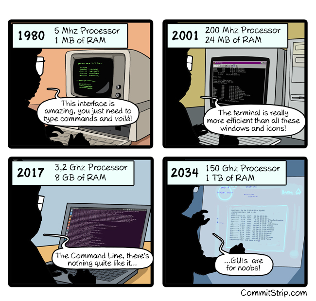

# Briant's Better Dotfiles



## Rationale

These are my *better* dotfiles. Instead of turning my whole home directory into a repo (which sucks), I decided to put something together
that manages my dotfiles and packages. A few goals that this repo aims to achieve:

1. Easy to set up a new machine (dotfiles, common packages, etc.)
1. Centralized dotfiles, configs, scripts, etc.
1. Cross platform (macOS & Linux)
1. Cross shell (bash, zsh)
1. Ability to add per-machine shell customizations

## Initial Machine Setup

When you get a new machine, run the following commands to get everything set up:

1. Clone this repo to `~/Projects/`
1. Run the bootstrap script to get the initial dependencies:
    
    ```bash
    ./scripts/bootstrap.sh
    ```
   
1. Run the Ansible playbook:

    ```bash
   ansible-playbook ansible/site.yml -K
    ```
   *Note*: The `-K` flag prompts for your sudo/admin password.
   
1. Restart your shell

## Subsequent Management and Maintenance

Once the dotfiles are set up, do the following to update on each machine:

1. Pull the repo

    ```bash
    cd ~/Projects/better-dotfiles
    git pull
    ```
   
1. Run the playbook again:

    ```bash
    ansible-playbook ansible/site.yml -K
    ```

## Components

### Ansible Playbooks

Ansible is my management tool of choice. It's cross-platform, does not have any additional dependencies, and already
knows how to manage packages, symlinks, files, and likely anything I'll need in the future. The playbooks are organized
as follows:

```
ansible/
├── site.yml
└── roles/
    ├── dotfiles_links/     # Symlinks configs into home directory
    ├── editor_setup/       # Neovim + vim-plug + plugins
    ├── platform_base/      # Package installation (brew / apt)
    ├── shell_setup/        # Oh My Zsh + zsh plugins
    └── terminal_setup/     # tmux, fzf, powerline, iTerm2
```

The complete playbook does the following:
- Symlinks configs and scripts into your home directory
- Installs packages via `brew` (macOS) or `apt` (Debian/Ubuntu)
- Sets up Neovim with vim-plug
- Installs Powerline fonts
- Installs tmux plugin manager (TPM) and plugins
- Installs Oh My Zsh and zsh plugins
- Copies iTerm2 preferences (macOS only)

Optionally, there are tags that can target specific parts of the playbook:
- `platform` — package installation
- `dotfiles` — symlinks and config files
- `editor` — Neovim setup
- `terminal` — tmux, fzf, powerline, iTerm2
- `shell` — Oh My Zsh and zsh plugins

To use the tags, run the playbook with the `--tags` flag:

```bash
ansible-playbook ansible/site.yml -K --tags platform # packages only
ansible-playbook ansible/site.yml -K --tags dotfiles,shell # symlinks and shell only
```

### Shell Scripts

Utility scripts are organized as follows:

```
scripts/
├── bootstrap.sh        # Initial machine setup (installs Ansible, etc.)
├── git/                # Git prompt and tab completion helpers
├── macos/              # macOS-specific utilities
└── shell/              # Shell utilities
```

### Dotfiles

I have curated my preferred default set of dotfiles for my shell tools. These files are organized as follows:

```
configs/
├── claude/     # Claude Code configuration and agent instructions
├── editor/     # Neovim and IdeaVim (RubyMine) configs
├── git/        # gitconfig (with local override support)
├── macos/      # macOS-specific configs (iTerm2)
├── shell/      # Shell configs (zsh, bash, shared aliases/functions)
└── tmux/       # tmux config and session layouts
```

These files are symlinked to the appropriate home directory location by the playbook.

The IdeaVim config at `configs/editor/.ideavimrc` is symlinked to `~/.ideavimrc` automatically. If you add RubyMine settings to `configs/rubymine/` (e.g. `keymaps`, `colors`, `options`), the playbook will detect your RubyMine config directory on macOS and symlink each item into it.

### Machine-Specific Dotfiles

I have configurations that I want to stay on individual machines. For example, I might have work-specific configurations
that I don't want to commit here. The general dotfiles, referenced above, look for these local files and load them if
they exist.

#### Bash and Zsh

Copy the example config or create a new one:

```bash
cp configs/shell/local/.rc.local.example ~/.rc.local
# OR
touch ~/.rc.local
```

Add any machine-specific overrides or configurations to `~/.rc.local`, then restart your shell.

#### Git

Copy the example config or create a new one:

```bash
cp configs/git/.gitconfig.local.example ~/.gitconfig.local
# OR
touch ~/.gitconfig.local
```

Add any machine-specific overrides or configurations to `~/.gitconfig.local`, then restart your shell.


### Keybindings

See [KEYBINDINGS.md](KEYBINDINGS.md) for tmux and Vim/Neovim keybindings.
